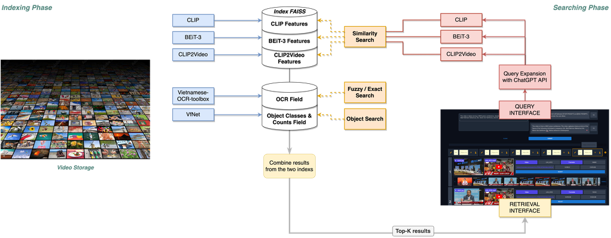

# 🌳 Vi-ATISO: An Effective Video Search Engine at AI Challenge HCMC 2023

## Introduction
Vi-ATISO is an efficient and versatile system built as a collection of microservices to support various search functions related to video content. It offers functionalities such as Image Retrieval, Video Retrieval, Object Search, and OCR Search. Whether you're looking for specific visual elements or events within videos, extracting text information, or searching for objects with counts, our system has you covered.

**Keywords:** Lifelog, Video Event Retrieval, Interactive Retrieval System

## Key Features
- **Text-to-Image Retrieval:** Leverage the power of [CLIP](https://arxiv.org/abs/2103.00020) and [BEiT-3](https://arxiv.org/abs/2208.10442) models to perform text-based image retrieval, allowing users to find frames based on their description.
- **Text-to-Video Retrieval:** Utitlize the [CLIP2Video](https://arxiv.org/abs/2106.11097) model for efficient text-to-video retrieval, enabling the search based on visual elements and temporal information.
- **Object Search**: Utilize the [VFNet model](https://arxiv.org/abs/2008.13367) as an object detector, a video can be searched by the objects detected in its keyframes. Users can search for any combinations of objects classes with any or specific number of occurences.
- **OCR Search:** Leverage the [Vietnamese-OCR-Toolbox](https://github.com/kaylode/vietnamese-ocr-toolbox) for Keyword-based Image Search.

## Sytem Design

*Vi-ATISO's System Overview*

## Services
Documents for APIs development and deployment:
- [CLIP Image Retrieval](https://github.com/nxquang-al/vi-atiso/tree/main/services/clip-itr)
- [BEiT-3 Image Retrieval](https://github.com/nxquang-al/vi-atiso/tree/main/services/clip-itr)
- [CLIP2Video Video Retrieval](https://github.com/nxquang-al/vi-atiso/tree/main/services/clip2video-vtr)
- Object Search
- OCR Search

## License
This project is licensed under the [MIT License](./LICENSE).

## Contributing
As the project is done by multiple services, please follow the guide corresponding to the service you want to contribute to.

